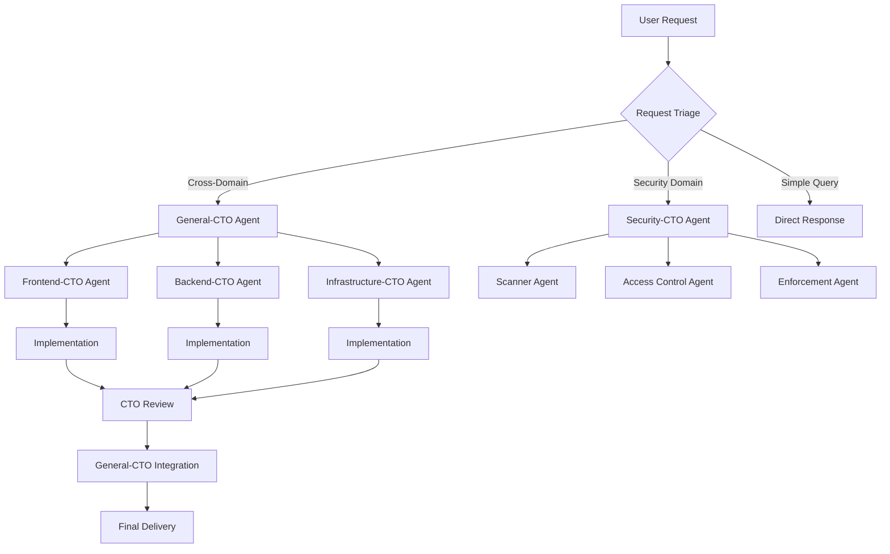
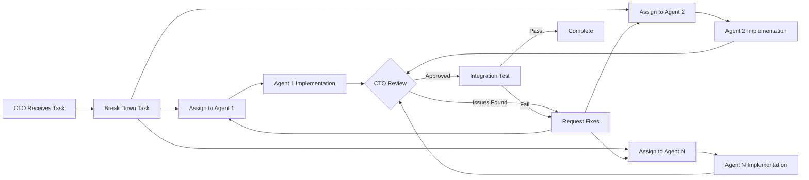
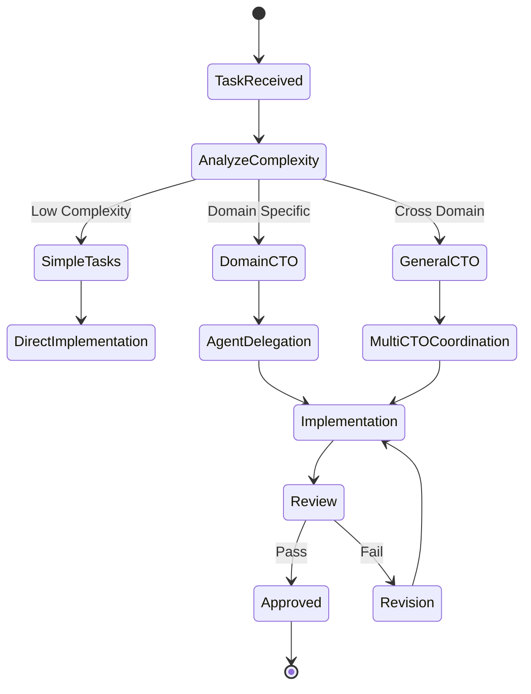
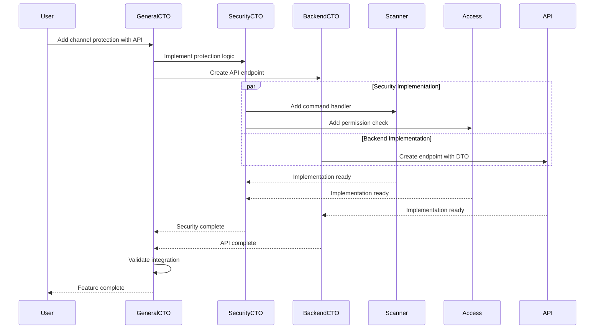
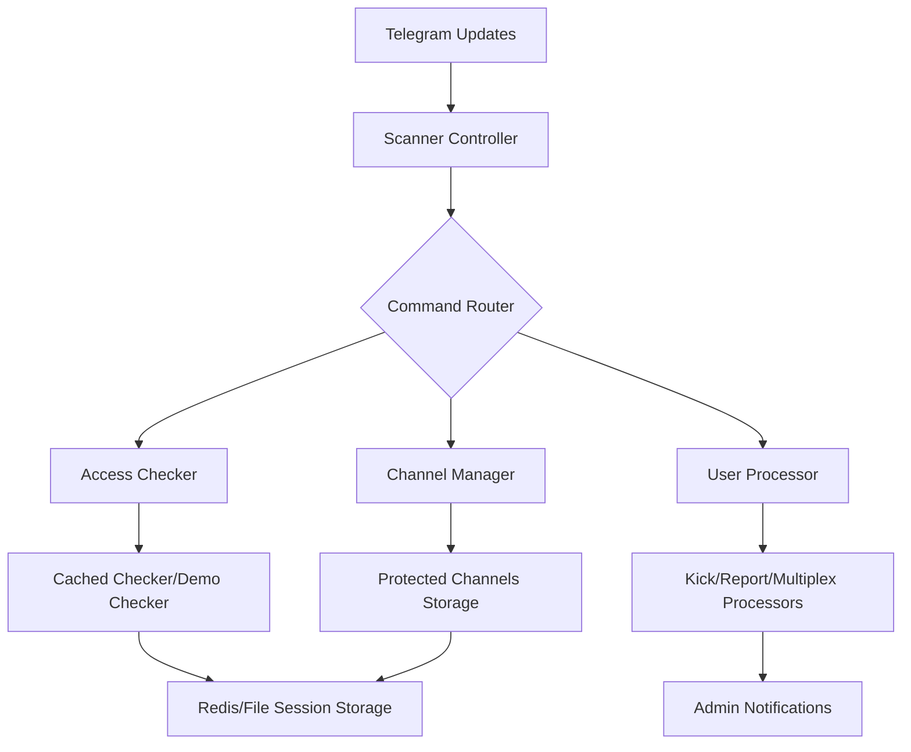
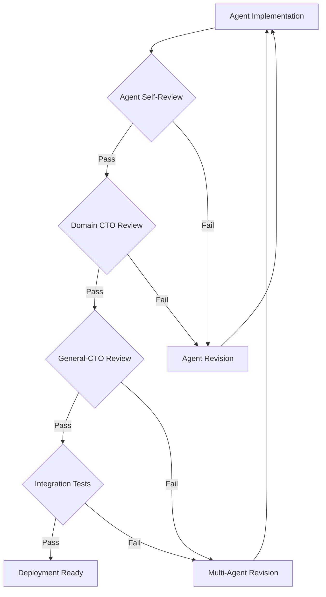

# Telegram NDA Guard - Development Guidelines

## 🚨 CRITICAL: Agent Orchestration Protocol

### Mandatory Agent-Based Development

**ALL development MUST follow the Agent Orchestration hierarchy.**



### Agent Hierarchy

#### 1. General-CTO Agent (Cross-Domain Coordinator)
**Purpose**: Orchestrate work across multiple domains without writing code directly.

**Responsibilities**:
- Coordinate between domain-specific CTOs
- Ensure TypeScript-first consistency across all domains
- Maintain shared DTOs between client-server
- Enforce code reuse patterns
- Review cross-domain integration points
- Prevent architectural violations

**Invocation Triggers**:
- Cross-domain features (e.g., API + UI changes)
- Shared data structure modifications
- Architecture-level decisions
- Tech stack consistency checks
- Integration testing requirements

**Workflow**:
```markdown
1. Receive cross-domain request
2. Analyze impact across domains
3. Delegate to domain CTOs with specifications
4. Ensure TypeScript contracts are maintained
5. Review integration points
6. Coordinate testing across domains
7. Validate consistency before approval
```

#### 2. Security-CTO Agent (Domain Orchestrator)
**Purpose**: Orchestrate all security-related development.

**Workflow**:
```markdown
1. Receive security feature request
2. Analyze security implications
3. Create implementation plan
4. Delegate to specialized agents:
   - Scanner Agent for command processing
   - Access Control Agent for permissions
   - Enforcement Agent for actions
   - Storage Agent for data security
5. Review implementations
6. Ensure security standards
7. Approve or request revisions
```

### Iterative CTO → Agents Approach



**Key Principles**:
1. **CTOs never write code** - They plan, delegate, and review
2. **Agents implement** - Domain experts handle actual coding
3. **Iterative refinement** - Multiple review cycles ensure quality
4. **Clear boundaries** - Each agent has specific responsibilities
5. **Traceable decisions** - All architectural choices documented

---

## Philosophy with Agent-Driven Development

### Core Beliefs

- **Orchestration over implementation** – CTOs orchestrate, agents implement, ensuring expertise is properly applied.
- **Iterative agent collaboration over monolithic development** – Small, focused agents working in coordination.
- **TypeScript-first contracts** – All cross-domain communication uses strict TypeScript interfaces.
- **Security through specialization** – Security agents handle security, never mix concerns.
- **Traceable delegation** – Every decision and delegation is documented and reviewable.

### Agent Collaboration Patterns

```typescript
// Cross-Domain DTO Example (enforced by General-CTO)
// shared/dto/channel-protection.dto.ts

export interface ChannelProtectionDTO {
  channelId: number;
  protectionLevel: 'basic' | 'advanced' | 'maximum';
  verificationMethods: VerificationMethod[];
  lastChecked: Date;
  status: ProtectionStatus;
}

// Used by both frontend and backend agents
// General-CTO ensures this contract is maintained
```

---

## Process - Agent-Driven Workflow

### 1. Task Reception and Triage



### 2. General-CTO Coordination Flow

**For Cross-Domain Features:**

```markdown
## General-CTO Task: Add Real-time Channel Monitoring Dashboard

### 1. Impact Analysis
- Frontend: New dashboard component
- Backend: WebSocket endpoint, monitoring service
- Database: Metrics storage schema
- Infrastructure: Redis pub/sub setup

### 2. TypeScript Contract Definition
```typescript
// Define shared interfaces FIRST
interface MonitoringEventDTO {
  timestamp: number;
  channelId: number;
  eventType: 'user_joined' | 'user_left' | 'violation_detected';
  metadata: Record<string, unknown>;
}
```

### 3. Delegation Plan
- Backend-CTO: Implement WebSocket service with DTO
- Frontend-CTO: Create dashboard using same DTO
- Infrastructure-CTO: Setup Redis pub/sub
- Security-CTO: Add monitoring permissions

### 4. Integration Points
- WebSocket protocol specification
- Error handling standards
- Retry logic consistency
- State management approach

### 5. Validation Criteria
- [ ] DTOs match exactly between frontend/backend
- [ ] TypeScript strict mode passes
- [ ] Integration tests pass
- [ ] Security review complete
```

### 3. Domain-CTO Iterative Process

```markdown
## Security-CTO Task: Implement Channel Access Verification

### Iteration 1: Planning
1. Break down into components:
   - Access checker module
   - Cache layer
   - Audit logging
   
2. Assign to agents:
   - Access-Control-Agent: Core logic
   - Storage-Agent: Cache implementation
   - Monitoring-Agent: Audit system

### Iteration 2: Initial Implementation
- Agents work in parallel
- Each submits implementation
- CTO reviews for consistency

### Iteration 3: Integration
- CTO coordinates agent outputs
- Ensures interfaces align
- Tests integration points

### Iteration 4: Refinement
- Address review feedback
- Optimize performance
- Add error handling

### Iteration 5: Final Review
- Security audit
- Performance benchmarks
- Documentation complete
```

---

## Technical Standards - Agent Responsibilities

### General-CTO Standards

**TypeScript-First Enforcement:**
```typescript
// ENFORCED: Shared types must be in shared/ directory
// shared/types/security.types.ts

export interface SecurityContext {
  userId: number;
  permissions: Permission[];
  sessionId: string;
  expiresAt: Date;
}

// ENFORCED: Both frontend and backend import from shared
import { SecurityContext } from '@shared/types/security.types';
```

**Code Reuse Patterns:**
```typescript
// shared/validators/telegram.validators.ts
export const validateTelegramId = (id: unknown): id is number => {
  return typeof id === 'number' && id > 0 && id < Number.MAX_SAFE_INTEGER;
};

// Used by multiple agents, enforced by General-CTO
```

### Security Domain Agent Standards

#### Scanner-Controller Agent
```go
// Responsibility: Command processing
// Reports to: Security-CTO
// Interfaces with: Telegram Bot API

type CommandHandler interface {
    // Must implement security checks
    Authorize(ctx context.Context, user User) error
    // Must log all actions
    Execute(ctx context.Context, cmd Command) Result
    // Must handle errors gracefully
    HandleError(ctx context.Context, err error)
}
```

#### Access-Control Agent
```go
// Responsibility: Permission verification
// Reports to: Security-CTO
// Interfaces with: Cache, Database

type AccessChecker interface {
    // Never cache admin operations
    CheckAccess(ctx context.Context, user User, resource Resource) bool
    // Always audit decisions
    LogDecision(ctx context.Context, decision Decision)
    // Fail closed on errors
    HandleFailure(ctx context.Context, err error) bool // always false
}
```

---

## Agent Communication Protocols

### Inter-Agent Communication



### Agent Handoff Protocol

```markdown
## Handoff Document Template

### From: [Source Agent]
### To: [Target Agent]
### Task: [Description]

#### Context
- Previous work completed
- Current state of system
- Dependencies resolved

#### Requirements
- Specific implementation needed
- Interfaces to implement
- Standards to follow

#### Constraints
- Technical limitations
- Security requirements
- Performance targets

#### Deliverables
- [ ] Code implementation
- [ ] Tests (>80% coverage)
- [ ] Documentation
- [ ] Integration points

#### Review Criteria
- Passes CTO review
- Meets security standards
- TypeScript contracts maintained
```

---

## Security Architecture

### Core Security Components



### Security Patterns

**Every security feature must:**
- Log security events with correlation IDs
- Implement rate limiting
- Handle Telegram API errors gracefully
- Provide admin override capabilities
- Support rollback/undo operations

**Security Testing Requirements:**
- Test with malicious user scenarios
- Verify rate limit handling
- Check permission boundaries
- Test failover mechanisms

### Error Handling in Security Context

```go
// Security-first error handling
if err != nil {
    // 1. Log security event
    d.log.SecurityEventf("Access denied: user=%d, channel=%d, reason=%v", 
        userID, channelID, err)
    
    // 2. Notify admin if critical
    if isCriticalSecurityError(err) {
        d.notifyAdmin(ctx, "Critical security event", err)
    }
    
    // 3. Fail closed - deny access
    return false, fmt.Errorf("access denied: %w", err)
}
```

---

## Quality Gates with Agent Validation

### Multi-Level Review Process



### Agent-Specific Quality Criteria

#### For General-CTO Reviews
- [ ] TypeScript strict mode compliance
- [ ] Shared DTOs properly defined
- [ ] No code duplication across domains
- [ ] Consistent error handling patterns
- [ ] Cross-domain tests passing

#### For Security-CTO Reviews
- [ ] Security audit completed
- [ ] Threat model documented
- [ ] Fail-closed implementation
- [ ] Audit logging in place
- [ ] Rate limiting implemented

#### For Agent Implementations
- [ ] Single responsibility maintained
- [ ] Interface contracts met
- [ ] Test coverage >80%
- [ ] Documentation complete
- [ ] Review feedback addressed

---

## Agent Directory

### Orchestration Layer

| Agent | Role | Responsibilities | Never Does |
|-------|------|-----------------|------------|
| General-CTO | Cross-Domain Orchestrator | Coordinates multiple CTOs, enforces TypeScript standards, maintains shared contracts | Write implementation code |
| Security-CTO | Security Domain Lead | Orchestrates security agents, ensures security standards, reviews threat models | Implement features directly |
| Backend-CTO | Backend Domain Lead | Manages API agents, database agents, service agents | Touch frontend code |
| Frontend-CTO | Frontend Domain Lead | Manages UI agents, state agents, integration agents | Modify backend logic |
| Infrastructure-CTO | Infrastructure Lead | Manages deployment, monitoring, scaling agents | Modify business logic |

### Implementation Layer - Security Domain

| Agent | Specialization | Reports To | Key Interfaces |
|-------|---------------|-----------|----------------|
| Scanner-Agent | Command Processing | Security-CTO | Telegram Bot API |
| Access-Agent | Permission Verification | Security-CTO | Cache, Database |
| Enforcement-Agent | Security Actions | Security-CTO | Telegram API |
| Storage-Agent | Secure Data | Security-CTO | Redis, PostgreSQL |
| Audit-Agent | Security Logging | Security-CTO | Logging System |

### Implementation Layer - Backend Domain

| Agent | Specialization | Reports To | Key Interfaces |
|-------|---------------|-----------|----------------|
| API-Agent | REST Endpoints | Backend-CTO | Express/NestJS |
| Database-Agent | Data Persistence | Backend-CTO | TypeORM/Prisma |
| Queue-Agent | Async Processing | Backend-CTO | Bull/BullMQ |
| WebSocket-Agent | Real-time Comm | Backend-CTO | Socket.io |
| Integration-Agent | External Services | Backend-CTO | HTTP Clients |

---

## Telegram-Specific Guidelines

### Working with Telegram APIs

1. **Bot API Limits:**
   - 30 messages/second to different chats
   - 20 messages/minute to same chat
   - Always implement exponential backoff

2. **Userbot Considerations:**
   - Use session storage for persistence
   - Handle phone number verification
   - Implement anti-flood protection
   - Respect Telegram TOS

3. **Channel Management:**
   - Verify bot has admin rights
   - Handle large member lists efficiently
   - Implement pagination for user lists
   - Cache channel metadata appropriately

### Security Best Practices

**NEVER:**
- Store Telegram passwords in plaintext
- Share session files publicly
- Exceed API rate limits
- Bypass Telegram security features
- Log sensitive user data

**ALWAYS:**
- Validate Telegram webhook signatures
- Use secure session storage
- Implement proper error handling
- Log security events
- Provide admin oversight

---

## Development Commands

### Running the Service
```bash
# Development
go run cmd/example/main.go

# With environment variables
cp .env.example .env
# Edit .env with your credentials
go run cmd/example/main.go

# Testing
go test ./...
go test -v ./controllers/scanner/...
go test -cover ./checker/...

# Mocking
mockgen -source=checker/cached/dep.go -destination=checker/cached/dep_mock_test.go
```

### Security Verification
```bash
# Check for security vulnerabilities
go get -u github.com/securego/gosec/v2/cmd/gosec
gosec ./...

# Static analysis
go vet ./...
golint ./...

# Dependency audit
go list -m all | nancy sleuth
```

---

## Practical Examples

### Example 1: Cross-Domain Feature

**User Request**: "Add a dashboard showing real-time channel protection status"

```markdown
1. **Triage**: Cross-domain (UI + Backend + Security)
2. **General-CTO Activation**:
   - Defines ProtectionStatusDTO
   - Coordinates three CTOs
   
3. **Delegation**:
   - Frontend-CTO → Dashboard-Agent
   - Backend-CTO → WebSocket-Agent, API-Agent  
   - Security-CTO → Monitor-Agent
   
4. **Integration**:
   - General-CTO ensures DTO consistency
   - Reviews WebSocket protocol
   - Validates security permissions
   
5. **Delivery**: Integrated feature with consistent TypeScript types
```

### Example 2: Security-Only Feature

**User Request**: "Implement automatic kick for users without profile photos"

```markdown
1. **Triage**: Security domain only
2. **Security-CTO Activation**:
   - Creates threat model
   - Plans implementation
   
3. **Delegation**:
   - Access-Agent: Check profile photo
   - Enforcement-Agent: Kick user
   - Audit-Agent: Log action
   
4. **Iteration**:
   - Round 1: Basic implementation
   - Round 2: Add rate limiting
   - Round 3: Add admin override
   
5. **Delivery**: Secure, audited feature
```

---

## Important Reminders

### ALWAYS

- **Start with General-CTO** for cross-domain work
- **Use domain CTOs** for domain-specific work
- **Let CTOs orchestrate**, never implement
- **Maintain TypeScript contracts** across domains
- **Document agent decisions** for traceability
- **Iterate through reviews** for quality

### NEVER

- **Skip the CTO layer** for complex tasks
- **Let agents work across domains** without General-CTO
- **Mix security code** with business logic
- **Duplicate DTOs** between frontend/backend
- **Allow CTOs to write code** directly
- **Bypass agent specialization** boundaries

---

## Emergency Override Protocol

Only in critical production issues:

```markdown
## Emergency Direct Implementation

**Condition**: Production down, immediate fix needed
**Authorization**: Admin approval required
**Process**:
1. Document the emergency
2. Implement minimal fix
3. Deploy with monitoring
4. Create proper agent task for permanent fix
5. Review in post-mortem
```

---

## Getting Started

### For New Features
1. Identify if cross-domain or single domain
2. Invoke appropriate CTO agent
3. Let CTO create implementation plan
4. Review agent implementations
5. Validate integration

### For Bug Fixes
1. Identify affected domain
2. Route to domain CTO
3. CTO assigns to specialized agent
4. Agent implements fix with tests
5. CTO reviews and approves

### For Architecture Changes
1. Always start with General-CTO
2. Document proposed changes
3. Get approval from all affected CTOs
4. Implement through agent hierarchy
5. Validate consistency across domains

---

*This configuration ensures high-quality development through proper agent orchestration, with General-CTO maintaining cross-domain consistency and domain CTOs ensuring specialized expertise is properly applied.*